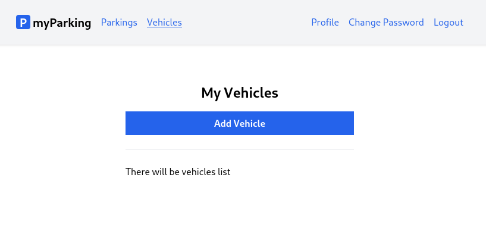
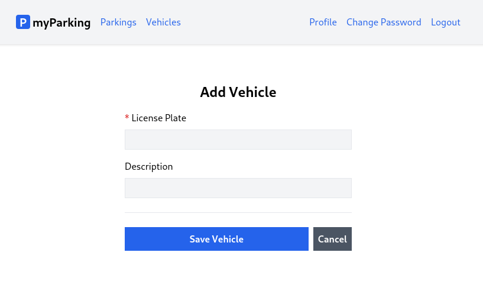

# Lesson 13 - Create a vehicle

In order to be able to book parking in a specific zone, the user must first add their own vehicles. This lesson will
focus on implementing the first CRUD operation.



And the form to add a vehicle will look like this. After pressing the `Save Vehicle` button form is submitted to the
server and then redirected back to the list. Pressing the `Cancel` button redirect will discard the form data without
submitting it and will redirect back to the list.



1. Create a new `src/hooks/useProduct.jsx` hook.

```jsx
import {useState} from 'react'
import {useNavigate} from 'react-router-dom'
import {route} from '@/routes'

export function useProduct() {
    const [errors, setErrors] = useState({})
    const [loading, setLoading] = useState(false)
    const [data, setData] = useState({})
    const navigate = useNavigate()

    function createVehicle(data) {
        setLoading(true)
        setErrors({})

        return axios.post('vehicles', data)
            .then(() => navigate(route('vehicles.index')))
            .catch(error => {
                if (error.response.status === 422) {
                    setErrors(error.response.data.errors)
                }
            })
            .finally(() => setLoading(false))
    }

    return {
        vehicle: {data, setData, errors, loading},
        createVehicle,
    }
}
```

2. Create a new `src/views/vehicles/CreateVehicle.jsx` component.

```jsx
import {useNavigate} from 'react-router-dom'
import {useProduct} from '@/hooks/useProduct'
import {route} from '@/routes'
import ValidationError from '@/components/ValidationError'
import IconSpinner from '@/components/IconSpinner'

function CreateVehicle() {
    const {vehicle, createVehicle} = useProduct()
    const navigate = useNavigate()

    async function handleSubmit(event) {
        event.preventDefault()

        await createVehicle(vehicle.data)
    }

    return (
        <form onSubmit={handleSubmit} noValidate>
            <div className="flex flex-col mx-auto md:w-96 w-full">

                <h1 className="heading">Add Vehicle</h1>

                <div className="flex flex-col gap-2 mb-4">
                    <label htmlFor="plate_number" className="required">License Plate</label>
                    <input
                        id="plate_number"
                        name="plate_number"
                        type="text"
                        value={vehicle.data.plate_number ?? ''}
                        onChange={event => vehicle.setData({
                            ...vehicle.data,
                            plate_number: event.target.value,
                        })}
                        className="form-input plate"
                        disabled={vehicle.loading}
                    />
                    <ValidationError errors={vehicle.errors} field="plate_number"/>
                </div>

                <div className="flex flex-col gap-2">
                    <label htmlFor="description">Description</label>
                    <input
                        id="description"
                        name="description"
                        type="text"
                        value={vehicle.data.description ?? ''}
                        onChange={event => vehicle.setData({
                            ...vehicle.data,
                            description: event.target.value,
                        })}
                        className="form-input"
                        disabled={vehicle.loading}
                    />
                    <ValidationError errors={vehicle.errors} field="email"/>
                </div>

                <div className="border-t h-[1px] my-6"></div>

                <div className="flex items-center gap-2">
                    <button
                        type="submit"
                        className="btn btn-primary w-full"
                        disabled={vehicle.loading}
                    >
                        {vehicle.loading && <IconSpinner/>}
                        Save Vehicle
                    </button>

                    <button
                        type="button"
                        className="btn btn-secondary"
                        disabled={vehicle.loading}
                        onClick={() => navigate(route('vehicles.index'))}
                    >
                        <span>Cancel</span>
                    </button>
                </div>
            </div>
        </form>
    )
}

export default CreateVehicle
```

For the cancel action, we created a regular button with the `type="button"` attribute, and added an `onClick` handler
with an anonymous function to navigate to the `vehicles.index` named route.

```jsx
<button
    type="button"
    className="btn btn-secondary"
    disabled={vehicle.loading}
    onClick={() => navigate(route('vehicles.index'))}
>
    <span>Cancel</span>
</button>
```

We didn't use `Link` or `NavLink` for this purpose because they don't support the `disabled` property and we want to
prevent cancel action while the form is being processed.

3. Add a new named route `'vehicles.create': '/vehicles/create',` in the `src/routes/index.jsx` file.

```jsx
const routeNames = {
    'home': '/',
    'register': '/register',
    'login': '/login',
    'profile.edit': '/profile',
    'profile.change-password': '/profile/change-password',
    'vehicles.index': '/vehicles',
    'vehicles.create': '/vehicles/create',
    'parkings.active': '/parkings/active',
}
```

4. Update `src/main.jsx` by importing the newly created component.

```jsx
import CreateVehicle from '@/views/vehicles/CreateVehicle'
```

and defining a route for it

```jsx
<Route path={route('vehicles.create')} element={<CreateVehicle/>}/>
```

5. Finally update `src/views/vehicles/ProductList.jsx` with the following content to have a link to
   the `vehicles.create` form.

```jsx
import {Link} from 'react-router-dom'
import {route} from '@/routes'

function ProductList() {
    return (
        <div className="flex flex-col mx-auto md:w-96 w-full">

            <h1 className="heading">My Vehicles</h1>

            <Link to={route('vehicles.create')} className="btn btn-primary">
                Add Vehicle
            </Link>

            <div className="border-t h-[1px] my-6"></div>

            <div>There will be vehicles list</div>
        </div>
    )
}

export default ProductList
```

Let's move forward to the next lesson and display the vehicles list on the client.