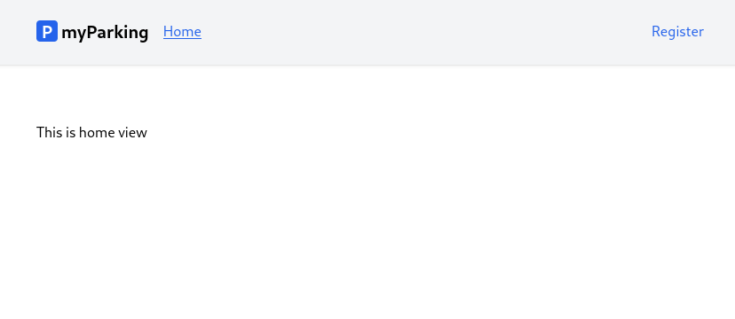
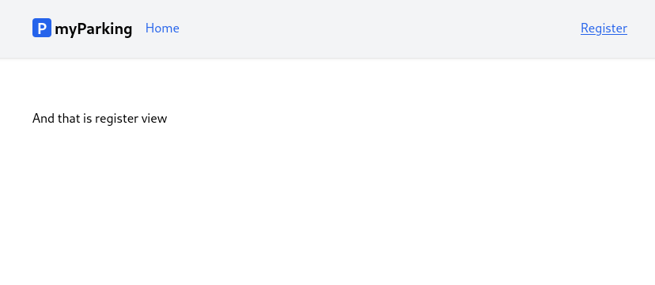

# Lesson 3 - React routing

In this lesson let's set up react router to be able to navigate between views.





1. By default react doesn't have included router so we need to install it manually with this command.

```shell
npm install react-router-dom --save
```

2. After successful installation let's prepare the first components we are going to navigate between. Create a new
   file `src/views/Home.jsx` with the following content.

```jsx
function Home() {
  return <div>This is home view</div>
}

export default Home
```

3. And new  `src/views/auth/Register.jsx` component.

```jsx
function Register() {
  return <div>And that is register view</div>
}

export default Register
```

4. Update the `src/main.jsx` file to this.

```jsx
import React from 'react'
import ReactDOM from 'react-dom/client'
import {BrowserRouter, Routes, Route} from 'react-router-dom'
import App from '@/App'
import Home from '@/views/Home'
import Register from '@/views/auth/Register'
import '@/assets/main.css'

ReactDOM.createRoot(document.getElementById('root')).render(
    <React.StrictMode>
        <BrowserRouter>
            <Routes>
                <Route path="/" element={<App/>}>
                    <Route index element={<Home/>}/>
                    <Route path="register" element={<Register/>}/>
                </Route>
            </Routes>
        </BrowserRouter>
    </React.StrictMode>,
)
```

Here we import `BrowserRouter`, `Routes`, and `Route` components from `react-router-dom`.

The whole app is wrapped in `<BrowserRoute>`. It stores the current location in the browser's address bar using clean
URLs and navigates using the browser's built-in history stack.

`<Routes>` will match a set of child routes from the current location. Whenever the location changes, `<Routes>` look
through all its child routes to find the best match and renders that branch of the UI. `<Route>` elements may be nested
to indicate nested UI, which also corresponds to nested URL paths. Parent routes render their child routes by rendering
an `<Outlet>`.

5. Update the `src/App.jsx` file.

```jsx
import {Outlet, NavLink} from 'react-router-dom'

function App() {
    return (
        <div className="App">
            <header className="py-6 bg-gray-100 shadow">
                <div className="container md:px-2 px-4 mx-auto">
                    <nav className="flex gap-4 justify-between">
                        <div className="flex gap-4 items-center">
                            <h2 className="text-xl font-bold">
                                <div
                                    className="inline-flex items-center justify-center bg-blue-600 w-6 h-6 text-center text-white rounded mr-1"
                                >
                                    P
                                </div>
                                myParking
                            </h2>
                            <NavLink end to="/" className={({isActive}) => {
                                return isActive ? 'text-blue-600 underline' : 'text-blue-600'
                            }}>Home</NavLink>
                        </div>
                        <div className="flex gap-4 items-center">
                            <NavLink end to="/register" className={({isActive}) => {
                                return isActive ? 'text-blue-600 underline' : 'text-blue-600'
                            }}>Register</NavLink>
                        </div>
                    </nav>
                </div>
            </header>
            <div className="container md:px-2 px-4 pt-8 md:pt-16 mx-auto">
                <Outlet/>
            </div>
        </div>
    )
}

export default App
```

In a place where `<Outlet />` is defined will be rendered our `<Home>` and `<Register>` components when the route
defined matches them.

A `<NavLink>` is a special kind of React's regular `<Link>` that knows whether or not it is "active". This is useful
when building a navigation menu where you'd like to show which of them is currently selected. It also provides useful
context for assistive technology like screen readers. You can pass a function to either `style` or `className` that will
allow you to customize the inline styling or the class string based on the component's active state. You can also pass a
function as children to customize the content of the `<NavLink>` component based on their active state, especially
useful to change styles on internal elements.

It looks like this.

```jsx
<NavLink end to="/" className={ ({isActive}) => {
  return isActive ? 'text-blue-600 underline' : 'text-blue-600'
} }>Home</NavLink>
```

If the `end` prop is used like in our case, it will ensure this component isn't matched as "active" when its descendant
paths are matched. For example, to render a link that is only active at the website root and not any other URLs.

Now you should have everything working and able to navigate between the newly created home and register pages.

Let's move to the next lesson.