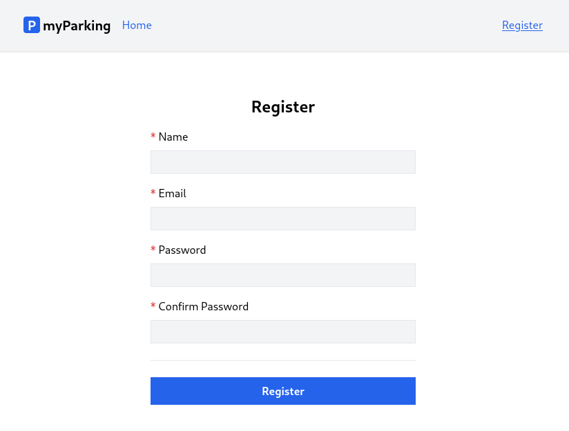

# Lesson 5 - Register page

In this lesson, we are going to update the Register page, use state and see how to handle the form submission.



Update `src/views/auth/Register.jsx` with the following content.

```jsx
import { useState } from 'react'

function Register() {
  const [name, setName] = useState('')
  const [email, setEmail] = useState('')
  const [password, setPassword] = useState('')
  const [passwordConfirmation, setPasswordConfirmation] = useState('')

  function handleSubmit(event) {
    event.preventDefault()
    const data = { name, email, password, passwordConfirmation }
    console.log(data)
  }

  return (
    <form onSubmit={ handleSubmit } noValidate>
      <div className="flex flex-col mx-auto md:w-96 w-full">

        <h1 className="heading">Register</h1>

        <div className="flex flex-col gap-2 mb-4">
          <label htmlFor="name" className="required">Name</label>
          <input
            id="name"
            name="name"
            type="text"
            value={ name }
            onChange={ event => setName(event.target.value) }
            className="form-input"
            autoComplete="name"
          />
        </div>

        <div className="flex flex-col gap-2 mb-4">
          <label htmlFor="email" className="required">Email</label>
          <input
            id="email"
            name="email"
            type="email"
            value={ email }
            onChange={ event => setEmail(event.target.value) }
            className="form-input"
            autoComplete="email"
          />
        </div>

        <div className="flex flex-col gap-2 mb-4">
          <label htmlFor="password" className="required">Password</label>
          <input
            id="password"
            name="password"
            type="password"
            value={ password }
            onChange={ event => setPassword(event.target.value) }
            className="form-input"
            autoComplete="new-password"
          />
        </div>

        <div className="flex flex-col gap-2">
          <label htmlFor="password_confirmation" className="required">Confirm Password</label>
          <input
            id="password_confirmation"
            name="password_confirmation"
            type="password"
            value={ passwordConfirmation }
            onChange={ event => setPasswordConfirmation(event.target.value) }
            className="form-input"
            autoComplete="new-password"
          />
        </div>

        <div className="border-t h-[1px] my-6"></div>

        <div className="flex flex-col gap-2 mb-4">
          <button type="submit" className="btn btn-primary">
            Register
          </button>
        </div>
      </div>
    </form>
  )
}

export default Register
```

This is an ordinary form to display our registration form. There are a few things I'd like to address.

First, we can see that we imported the `useState` hook from React.

`useState` is React Hook that lets you add a state variable to your component. It accepts the argument as an initial
state value. It also can be a function.

In our case, we have the following statement for our form field with an empty string as an initial value.

```jsx
const [name, setName] = useState('')
```

To display that initial value for the input field we can define the `value` property.

`value={ name }` set the input field's value to the value of the state variable `name`. When we pass the `value`
property, we must also pass the `onChange` handler that updates the passed value.

When we enter something in the field, the value is updated using the `onChange` event handler. Here we defined an
anonymous function that accepts that event and updates its value using the `setName()` function.

```jsx
<input
  id="name"
  name="name"
  type="text"
  value={ name }
  onChange={ event => setName(event.target.value) }
  className="form-input"
  autoComplete="name"
/>
```

Another not-so-important but rather convenient thing for users is the `autoComplete` attributes on form fields. It
defines what type of values can be auto-filled by the browser or for example password managers to generate a new
password if the user uses any. More information can be found
there [# HTML attribute: autocomplete](https://developer.mozilla.org/en-US/docs/Web/HTML/Attributes/autocomplete).

The same logic applies to all fields.

The form has an `onSubmit` handler, which calls the `handleSubmit()` function when we submit the form. `noValidate`
property tells the browser not to attempt any field validation by default, because we will implement validation to be
done by the server every time the form is submitted.

```jsx
<form onSubmit={ handleSubmit } noValidate>
```

`handleSubmit()` receives the event and calls `event.preventDefault()` which means when we submit the form default HTML
behavior will be prevented, otherwise, the page would just reload, so we do not want that in our case because we are
going to handle submission using XHR request.

```jsx
function handleSubmit(event) {
  event.preventDefault()
  const data = { name, email, password, passwordConfirmation }
  console.log(data)
}
```

For now, when you fill in form details, the data of your form can be seen in the console.

That's it for this lesson, and let's move on to another one.