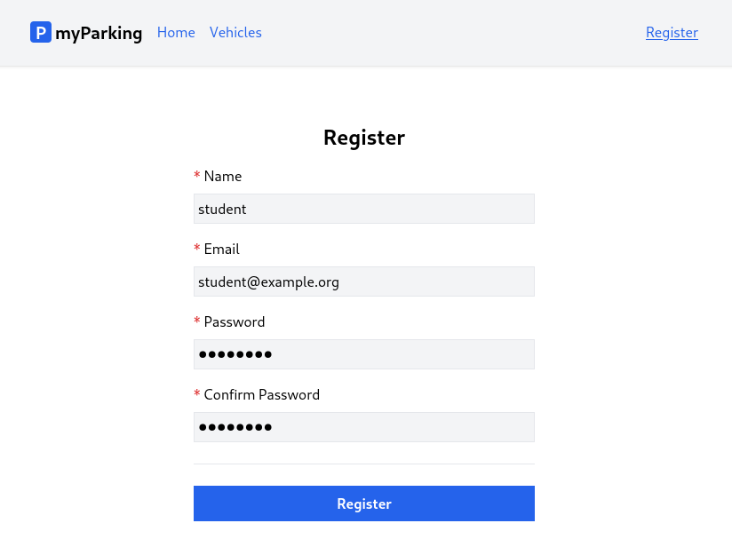
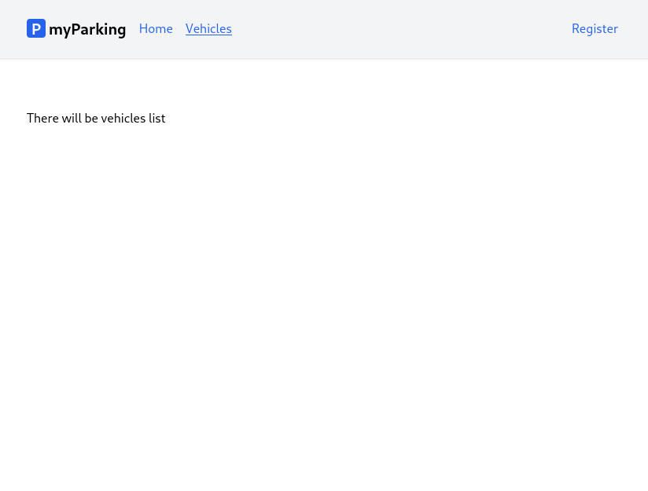

# Lesson 6 - Register implementation

In this lesson, we will implement form functionality to make a request to the server, and if the request was
successful (the user was registered) redirect to the vehicles list page.





1. First create a new `src/views/vehicles/ProductList.jsx` view for our future list. This is the page where the user
   will be redirected after registration.

```jsx
function ProductList() {
    return <div>There will be vehicles list</div>
}

export default ProductList
```

Add a new `vehicles.index` named route to the `src/routes/index.jsx` file.

```jsx
const routeNames = {
    'home': '/',
    'register': '/register',
    'vehicles.index': '/vehicles',
}
```

Define the new route in `src/main.jsx` right after the `register` route so the app can resolve the `/vehicles` path to
the `<ProductList>` component.

```jsx
import ProductList from '@/views/vehicles/ProductList'
```

```jsx
<Route path={route('register')} element={<Register/>}/>
<Route path={route('vehicles.index')} element={<ProductList/>}/>
```

And add `<NamedLink>` to the `vehicles.index` route in the `src/App.jsx` file. The file now should look like this.

```jsx
import {Outlet} from 'react-router-dom'
import NamedLink from '@/components/NamedLink'

function App() {
    return (
        <div className="App">
            <header className="py-6 bg-gray-100 shadow">
                <div className="container md:px-2 px-4 mx-auto">
                    <nav className="flex gap-4 justify-between">
                        <div className="flex gap-4 items-center">
                            <h2 className="text-xl font-bold">
                                <div
                                    className="inline-flex items-center justify-center bg-blue-600 w-6 h-6 text-center text-white rounded mr-1"
                                >
                                    P
                                </div>
                                myParking
                            </h2>
                            <NamedLink name="home">
                                Home
                            </NamedLink>
                            <NamedLink name="vehicles.index">
                                Vehicles
                            </NamedLink>
                        </div>
                        <div className="flex gap-4 items-center">
                            <NamedLink name="register">
                                Register
                            </NamedLink>
                        </div>
                    </nav>
                </div>
            </header>
            <div className="container md:px-2 px-4 pt-8 md:pt-16 mx-auto">
                <Outlet/>
            </div>
        </div>
    )
}

export default App
```

2. Now to make requests from our registration form we need to install the Axios library. Run this command in your shell.

```shell
npm install axios --save
```

Then we need to import and configure Axios in the `src/main.jsx` file.

```jsx
import axios from "axios";

window.axios = axios;

window.axios.defaults.headers.common["X-Requested-With"] = "XMLHttpRequest";
window.axios.defaults.withCredentials = true;
window.axios.defaults.baseURL = "http://parkingapi.test/api/v1";
```

We set the `X-Requested-With` header to tell the server it is an XHR request, and it serves an additional purpose so the
server must consent to CORS policies.

Option `window.axios.defaults.withCredentials = true;` tells the axios library to send the cookies along the request.

The convenience option is `window.axios.defaults.baseURL = "http://parkingapi.test/api/v1";` so we can omit full URLs in
our requests and just type in the relative path of the server's API endpoint.

Now we have a setup for making requests to API. The content of the `src/main.jsx` file looks like this.

```jsx
import React from 'react'
import ReactDOM from 'react-dom/client'
import {BrowserRouter, Routes, Route} from 'react-router-dom'
import axios from 'axios'
import App from '@/App'
import Home from '@/views/Home'
import Register from '@/views/auth/Register'
import ProductList from '@/views/vehicles/ProductList'
import '@/assets/main.css'
import {route} from '@/routes'

window.axios = axios
window.axios.defaults.headers.common['X-Requested-With'] = 'XMLHttpRequest'
window.axios.defaults.withCredentials = true
window.axios.defaults.baseURL = 'http://parkingapi.test/api/v1'

ReactDOM.createRoot(document.getElementById('root')).render(
    <React.StrictMode>
        <BrowserRouter>
            <Routes>
                <Route path={route('home')} element={<App/>}>
                    <Route index element={<Home/>}/>
                    <Route path={route('register')} element={<Register/>}/>
                    <Route path={route('vehicles.index')} element={<ProductList/>}/>
                </Route>
            </Routes>
        </BrowserRouter>
    </React.StrictMode>,
)
```

3. React comes with several built-in Hooks like `useState`. Sometimes you'll wish that there was a Hook for some more
   specific purpose: for example to fetch data, hold loading state, and errors. You might not find these Hooks in React,
   we can create Hooks for our application's needs.

Custom hooks let us share stateful logic, but not the state itself. Components using hooks don't have as much repetitive
logic. When we extract logic into custom hooks, we can hide the gnarly details of how we deal with some external system
or a browser API. The components then express intent and not the implementation.

Hook names must start with `use` followed by a capital letter. So let's create our first hook `useAuth` which will
implement logic related to our application's auth processes.

Create a new `src/hooks/useAuth.jsx` file with the following content.

```jsx
import {useNavigate} from 'react-router-dom'
import {route} from '@/routes'

export function useAuth() {
    const navigate = useNavigate()

    async function register(data) {
        return axios.post('auth/register', data)
            .then(() => {
                navigate(route('vehicles.index'))
            })
            .catch(() => {
            })
    }

    return {register}
}
```

Here we define the `register` function to make a call to `http://parkingapi.test/api/v1/auth/register`. Remember we
don't need to define the full URL because we have baseURL set for Axios. If the request is successful then we have
another hook `useNavigate` from React Router to navigate us to the `vehicles.index` route.

The `useAuth()` hook returns the register function, so we can use that function in our `<Register>` component.

4. Update the `src/views/auth/Register.jsx` component with the following content.

```jsx
import { useState } from 'react'
import { useAuth } from '@/hooks/useAuth'

function Register() {
  const [name, setName] = useState('')
  const [email, setEmail] = useState('')
  const [password, setPassword] = useState('')
  const [passwordConfirmation, setPasswordConfirmation] = useState('')
  const { register } = useAuth()

  async function handleSubmit(event) {
    event.preventDefault()

    await register({ name, email, password, password_confirmation: passwordConfirmation })

    setPassword('')
    setPasswordConfirmation('')
  }

  return (
    <form onSubmit={ handleSubmit } noValidate>
      <div className="flex flex-col mx-auto md:w-96 w-full">

        <h1 className="heading">Register</h1>

        <div className="flex flex-col gap-2 mb-4">
          <label htmlFor="name" className="required">Name</label>
          <input
            id="name"
            name="name"
            type="text"
            value={ name }
            onChange={ event => setName(event.target.value) }
            className="form-input"
            autoComplete="name"
          />
        </div>

        <div className="flex flex-col gap-2 mb-4">
          <label htmlFor="email" className="required">Email</label>
          <input
            id="email"
            name="email"
            type="email"
            value={ email }
            onChange={ event => setEmail(event.target.value) }
            className="form-input"
            autoComplete="email"
          />
        </div>

        <div className="flex flex-col gap-2 mb-4">
          <label htmlFor="password" className="required">Password</label>
          <input
            id="password"
            name="password"
            type="password"
            value={ password }
            onChange={ event => setPassword(event.target.value) }
            className="form-input"
            autoComplete="new-password"
          />
        </div>

        <div className="flex flex-col gap-2">
          <label htmlFor="password_confirmation" className="required">Confirm Password</label>
          <input
            id="password_confirmation"
            name="password_confirmation"
            type="password"
            value={ passwordConfirmation }
            onChange={ event => setPasswordConfirmation(event.target.value) }
            className="form-input"
            autoComplete="new-password"
          />
        </div>

        <div className="border-t h-[1px] my-6"></div>

        <div className="flex flex-col gap-2 mb-4">
          <button type="submit" className="btn btn-primary">
            Register
          </button>
        </div>
      </div>
    </form>
  )
}

export default Register
```

Here we import the `useAuth` hook and `register` function.

```jsx
import { useAuth } from '@/hooks/useAuth'

// ...

const { register } = useAuth()
```

Then updated the `handleSubmit()` function to call the `register` function from the `useAuth` hook.

```jsx
async function handleSubmit(event) {
  event.preventDefault()

  await register({ name, email, password, password_confirmation: passwordConfirmation })

  setPassword('')
  setPasswordConfirmation('')
}
```

We also added

```jsx
setPassword('')
setPasswordConfirmation('')
```

Usually when you submit the form browser would automatically clear fields with `type="password"`, but because we are
preventing default behavior this won't happen by default and we need to do that manually to retain the same
functionality. This code will be always executed disregarding if the request resulted in success or error which is the
default behavior when posting forms.

After submitting the form the following response from the server will be returned:

```json
{ access_token: "118|CJv0t9yHJcPFsifkXyoMaiCJBpRyrmsXYDLENyAN" }
```

And you will be redirected to the `/vehicles` URL, but we still have a few things missing.

- Register form has no validation if some data is incorrect and missing
- When we register we don't save the token anywhere for protected API endpoints.

Let's finish with the form first and implement validation in the next lesson.